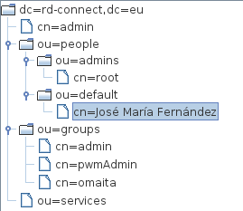
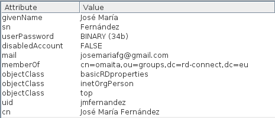
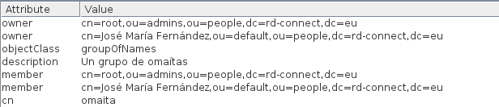

RD-Connect LDAP Layout
========

This document explains the LDAP layout used by RD-Connect.

1. First of all, the root of the directory has three organizational units hanging from it:
  * *people*, where user entries live.
  * *groups*, where group entries are hosted.
  * *services*, where CAS services permissions are stored

  

2. *people* organizational unit contains the user entries as descendants. The children of *people* are organization units, so users are better classified. The user creation program puts the user entry on one of the organizational units hanging from *people*.

  
  
  Each user entry at least belongs to `inetOrgPerson` and `basicRDproperties` object classes. Currently, the attributes in use are:
  
  * **uid**: The user name of the user, the one used on CAS.
  * **cn**: The common name (i.e. the fullname) of the user.
  * **givenName**: The user's given name.
  * **sn**: The user's surname.
  * **userPassword**: The hashed password, following LDAP standards.
  * **mail**: The e-mail address of the user.
  * **memberOf**: This is a multi-valued attribute, and contains the **dn** (distinguished names) of the groups the user belongs to.
  * **disabledAccount**: Whether the account is disabled or enabled.

  The **dn** of each user is the concatenation of the **cn** to the **dn** of the organizational unit where it is.
  
3. *groups* organizational unit contains the different group definitions as children. These group entries at least belong to `groupOfNames` object class, and they have at least next attributes:

  
  
  * **cn**: A short name of the group.
  * **description**: A description of the group.
  * **owner**: This is a multi-valued attribute, and contains the **dn** of each person who is owner of this group.
  * **member**: This is a multi-valued attribute, there must be at least one, and contains the **dn** of each person who belongs to this group.
  
4. *services* organizational unit will contain the different service access rules. These entries are managed using CAS management webapp, and their object type is `casRegisteredService`, with next attributes:

  * **uid**: A short name of the service.
  * **description**: The JSON representation of the different service access rules.
